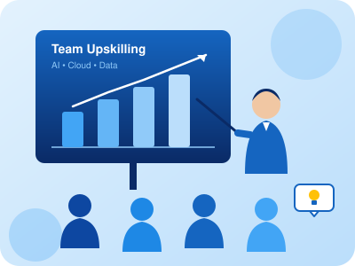

<!-- ===================== HEADER ===================== -->

  

<h1 align="center">Hi 👋, We're Aarush Coaching Classes</h1>
<h3 align="center">Corporate Training Partner — Upskilling Teams in AI, Data, Cloud & Technology 🇮🇳</h3>

  

  
  
  

---

<!-- ===================== ABOUT ===================== -->

### 🏢 About Us

- 🎯 **Mission:** Help organisations build future-ready teams through practical, industry-aligned training
- 👩‍🏫 **What we do:** Customised corporate workshops, bootcamps & long-term upskilling programs
- 🧑‍💼 **Who we train:** Freshers, working professionals, managers & leadership teams
- 🌐 **Delivery:** On-site • Live Virtual • Hybrid
- 🤖 Now offering **Microsoft Azure, Copilot & Generative AI** programs
- 📫 **Reach us at:** **aarushcoachingclasses@gmail.com**

 

---

<!-- ===================== PROGRAMS ===================== -->
### 📚 Corporate Training Programs

| | 💼 Program | 🎯 Focus Areas | ⏱️ Format |
|:--:|:--|:--|:--|
|  | **Microsoft Azure** | Azure fundamentals, Azure AI services, cloud deployment | Bootcamp |
|  | **Copilot for Productivity** | GitHub Copilot, Microsoft 365 Copilot, AI-assisted work | Workshop |
|  | **Generative AI & Prompt Engineering** | LLMs, prompting, AI agents, LangChain, responsible AI | Bootcamp |
|  | **AWS Cloud Foundations** | AWS essentials, deployment, cost awareness | Bootcamp |
|  | **Python for Professionals** | Core Python, automation, scripting | Workshop / Bootcamp |
|  | **Data Science & Analytics** | Pandas, NumPy, Seaborn, statistics, ML basics | Bootcamp |
|  | **SQL & Databases** | MySQL, SQL Server, reporting, optimisation | Workshop |
| 📊 | **Business Intelligence** | Excel, Power BI, dashboards, data storytelling | Workshop |
|  | **Web Fundamentals** | HTML, CSS, Git & GitHub collaboration | Workshop |

> ✅ Every program is **customised to your team** — pre-assessment, hands-on labs, capstone project & completion certificate.

---

<!-- ===================== WHY US ===================== -->
### 🌟 Why Choose Us?

  
  
  
  
  

---

<!-- ===================== TECH ===================== -->
### 🛠️ Technologies We Train On

  
  
  
  
  
  
  
  
  
  
  
  
  
  
  
  
  
  

---

<!-- ===================== WEBSITE ===================== -->
### 🌐 Visit Our Official Website — [aarushcoachingclasses.ai](https://aarushcoachingclasses.ai)

✨ Explore our courses, study resources, AI learning programs, and much more. Whether you're preparing for **NEET, JEE, Boards, AI, Data Science, or Professional Skills**, our website has something for every learner.

▶️ **Subscribe to our YouTube Channel:** [youtube.com/@AarushCoachingclasses](https://www.youtube.com/@AarushCoachingclasses)

---

<!-- ===================== HIGHLIGHTS ===================== -->
### 📊 Training at a Glance

  

---

<!-- ===================== CONNECT ===================== -->
### 📱 Follow Us on Social Media

  
  
  
  
  

<b>💼 Looking to upskill your team? Email us at <a href="mailto:aarushcoachingclasses@gmail.com">aarushcoachingclasses@gmail.com</a> for a customised training proposal!</b>

<!-- ===================== FOOTER ===================== -->

